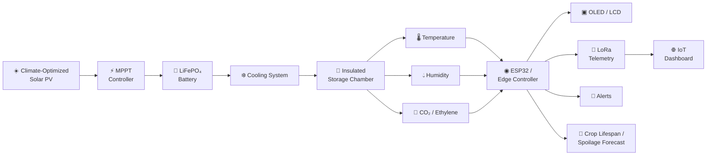
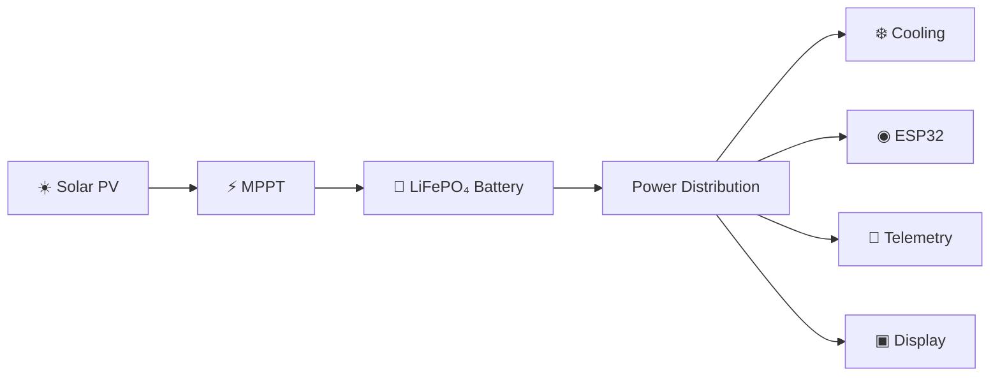
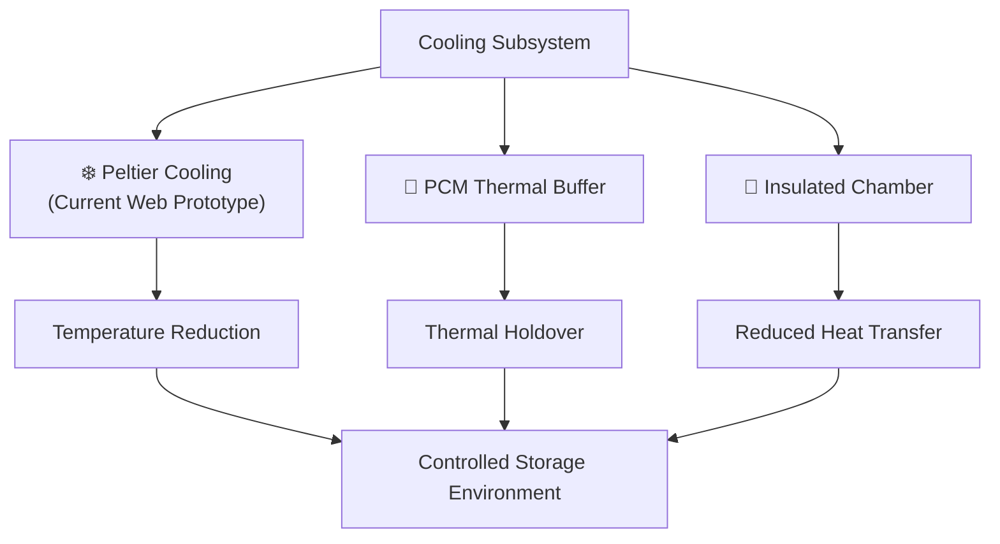
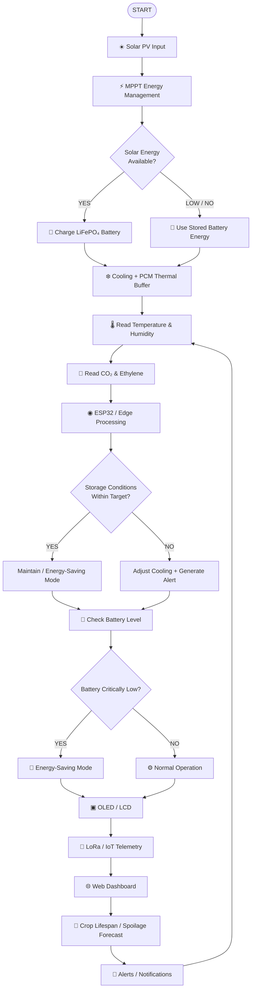
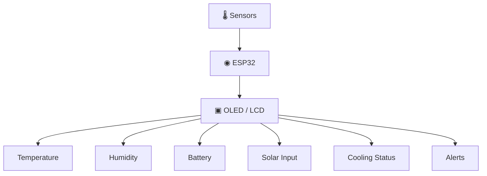
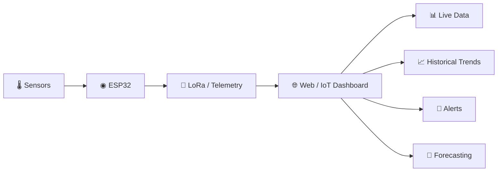
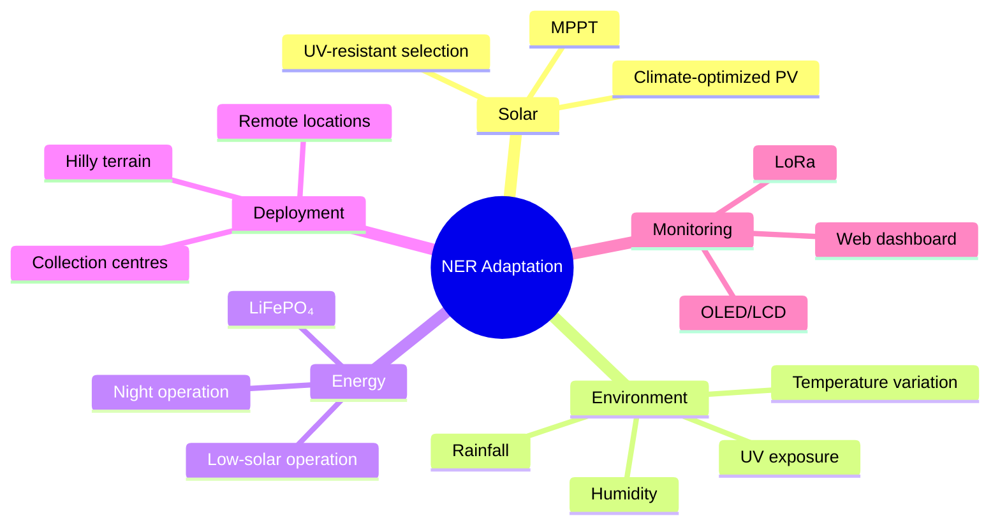
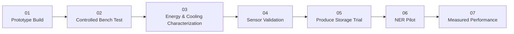
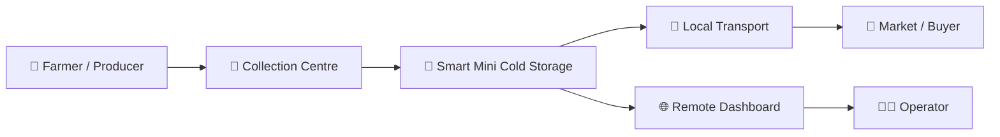

# 🌱 Solar-Powered Smart Mini Cold Storage System

## Smart India Hackathon 2026 — SIH26005

**Solar-Powered Smart Mini Cold Storage System for Fresh Vegetables in the North Eastern Region (NER)**

### 🏆 TEAM NEXUS FLOW

**Group Leader:** SUMIT SPANDAN JENA  
**Institution:** Alliance University  
**Domain:** Agriculture, Food Technology & Rural Development  
**Category:** Hardware

[🌐 Live Dashboard](https://ayushrkamal-dev.github.io/solar-smart-cold-storage/)  
[💻 GitHub Repository](https://github.com/ayushrkamal-dev/solar-smart-cold-storage)

---

# 📌 1. Project Overview

The **Solar-Powered Smart Mini Cold Storage System** is a proposed decentralized cold-chain solution designed for fresh vegetables and agricultural produce in the **North Eastern Region (NER) of India**.

The system combines renewable energy, energy storage, smart cooling, environmental sensing, local monitoring, remote monitoring and crop-condition forecasting into a compact cold-storage concept.

### Core capabilities

- ☀️ Climate-optimized / UV-resistant solar PV
- ⚡ MPPT solar energy management
- 🔋 LiFePO₄ battery storage
- ❄️ 12 V thermoelectric Peltier cooling in the current web prototype
- 🧊 PCM thermal buffering
- 🌡️ Temperature monitoring
- 💧 Humidity monitoring
- 🧪 CO₂ monitoring
- 🧪 Ethylene / ripening monitoring
- ◉ ESP32 / edge-control concept
- ▣ OLED/LCD local monitoring
- 📡 Offline-first LoRa telemetry
- 🌐 IoT / web dashboard
- 🚨 Fault and condition alerts
- 🧠 Crop lifespan and spoilage forecasting

> **Night-time operation is supported by stored electrical energy and thermal buffering. The system should not be described as generating solar electricity from sunlight during the night.**

---

# 🎯 2. Problem Statement

## SIH26005

**Solar-Powered Smart Mini Cold Storage System for Fresh Vegetables in NER**

Fresh produce in remote and hilly regions can face a first-mile cold-chain gap because of:

- Limited access to nearby cold-storage facilities
- Long transportation distances
- Variable electricity availability
- High ambient temperature and humidity
- Remote and difficult terrain
- Pressure to sell produce quickly
- Limited continuous visibility into storage conditions

### Existing Challenge

```text
        FARM
          │
          ▼
       HARVEST
          │
          ▼
 ┌───────────────────────┐
 │ LIMITED LOCAL         │
 │ COLD STORAGE ACCESS   │
 └───────────┬───────────┘
             │
             ▼
    LONG TRANSPORT / WAIT
             │
             ▼
     QUALITY LOSS RISK
             │
             ▼
        EARLY SALE
```

### Proposed Intervention

```text
        FARM
          │
          ▼
       HARVEST
          │
          ▼
 ┌────────────────────────────┐
 │ SMART MINI COLD STORAGE    │
 │                            │
 │ ☀️ Solar                  │
 │ 🔋 Battery                │
 │ ❄️ Cooling                │
 │ 🌡️ Sensors               │
 │ 📡 Monitoring             │
 └────────────┬───────────────┘
              │
              ▼
      CONTROLLED STORAGE
              │
              ▼
       BETTER VISIBILITY
              │
              ▼
     FLEXIBLE MARKET TIMING
```

---

# 💡 3. Proposed Solution

The proposed solution is a **modular, solar-powered and digitally monitored mini cold-storage unit** intended for farm-gates, collection centres, local aggregation points and remote/hilly locations.

## High-Level System Architecture



---

# ⚙️ 4. System Architecture

## 4.1 Energy Architecture



### Energy flow

**Solar PV → MPPT → LiFePO₄ Battery → Power Distribution → Cooling + Electronics**

The battery provides stored electrical energy during periods of low solar availability and at night.

---

## 4.2 Cooling & Thermal Architecture



> The current public web prototype represents **12 V thermoelectric Peltier cooling**. Hardware architecture and documentation should remain consistent with the actual prototype being presented.

---

# 🔄 5. Complete Implementation Flow



### Operating loop

**Sense → Decide → Cool → Monitor → Alert → Repeat**

---

# 🖥️ 6. Continuous Monitoring Architecture

The system has two monitoring layers.

## Local Monitoring



## Remote Monitoring



---

# 🌐 7. Live Web Dashboard

## Live Website

**https://ayushrkamal-dev.github.io/solar-smart-cold-storage/**

The current website demonstrates the proposed monitoring and decision-support interface.

### Dashboard modules

| Module | Purpose |
|---|---|
| 🌡️ Chamber Temperature | Storage temperature monitoring |
| 💧 Relative Humidity | Humidity monitoring |
| 🧪 CO₂ Respiration | Produce/environment indicator |
| 🧪 Ethylene Index | Ripening indicator |
| ⚡ Cooling Power | Cooling-system demand |
| ☀️ Solar PV Input | Solar generation |
| 🔋 Battery SoC | Stored energy |
| 🔒 Chamber Seal | Chamber status |
| 🥬 Crop Selection | Produce profile |
| 🧠 Safe Lifespan | Forecasting interface |
| ⚠️ Spoilage Hazard | Risk visualization |
| 📈 Environmental Envelope | Target-condition visualization |

### Prototype dashboard values

| Parameter | Example Display |
|---|---:|
| Chamber Temperature | 4.0 °C |
| Relative Humidity | 88 % RH |
| CO₂ Respiration | 615 ppm |
| Ethylene Index | 16 ppm |
| Peltier Draw | 5.4 A / 64.8 W |
| Solar PV Input | 182 W |
| LiFePO₄ SoC | 84 % |
| Projected Safe Lifespan | 24 days |
| Spoilage Hazard | Low |

> These values are **prototype/demo interface values** unless explicitly identified as measured experimental data.

---

# 🧩 8. Hardware Components

| Component | Function |
|---|---|
| ☀️ Solar PV | Renewable energy generation |
| ⚡ MPPT Controller | Solar energy management |
| 🔋 LiFePO₄ Battery | Energy storage |
| ❄️ Peltier Module | Current prototype cooling representation |
| 🧊 PCM | Thermal buffering |
| ◉ ESP32 | Edge processing and control |
| 🌡️ Temperature Sensor | Temperature monitoring |
| 💧 Humidity Sensor | Humidity monitoring |
| 🧪 CO₂ Sensor | Respiration/environment indicator |
| 🧪 Ethylene Sensor | Ripening indicator |
| ▣ OLED/LCD | Local monitoring |
| 📡 LoRa | Offline-first telemetry |
| 🌐 Web Dashboard | Remote monitoring |
| 🚨 Alert System | Abnormal-condition notification |
| 🧱 Insulation | Thermal isolation |
| 🌀 DC/BLDC Fan | Air circulation |

---

# 🏔️ 9. NER Climate Adaptation

The project is designed around the environmental and deployment conditions relevant to the **North Eastern Region**.

### Design considerations

- UV-resistant / climate-optimized PV selection
- Weather-protected electrical interfaces
- Insulated storage chamber
- Solar + battery energy architecture
- PCM thermal buffering
- Local monitoring
- Offline-first telemetry
- Remote web monitoring
- Compact and modular deployment

## NER Adaptation Map



---

# 🧠 10. Innovation & Uniqueness

### 01 — Decentralized Cold Storage
Cold-storage capability is positioned closer to farms and local collection points.

### 02 — Renewable Energy
Solar generation combined with battery storage supports operation where grid availability is limited.

### 03 — Smart Microclimate Monitoring
Continuous sensing provides visibility into the storage environment.

### 04 — Produce-Condition Intelligence
CO₂ and ethylene indicators are incorporated into the monitoring concept.

### 05 — Offline-First Telemetry
LoRa is intended to support data communication where conventional connectivity may be unreliable.

### 06 — Local + Remote Monitoring
The operator can use the on-unit display while remote users access the dashboard.

### 07 — Crop Lifespan Forecasting
The dashboard adds a decision-support layer for projected storage life and spoilage risk.

---

# 🔗 11. Problem → Solution Mapping

| Problem | Proposed Response |
|---|---|
| Limited nearby cold storage | Decentralized mini cold storage |
| Variable electricity | Solar + LiFePO₄ |
| Night operation | Stored electrical energy + PCM |
| Remote terrain | Modular compact architecture |
| Limited connectivity | Offline-first LoRa |
| Lack of visibility | Local display + web dashboard |
| Produce quality uncertainty | Temperature/RH + CO₂/ethylene |
| Forced early sale | Additional storage flexibility |
| System abnormality | Alerts + monitoring |

---

# 📈 12. Expected Impact

## 🌱 Social Impact

- Better access to local cold-chain infrastructure
- Greater storage flexibility
- Support for remote agricultural communities

## 💰 Economic Impact

- Potential reduction in avoidable post-harvest losses
- Greater flexibility around market timing
- Better utilization of locally produced vegetables

## 🌍 Environmental Impact

- Renewable-energy-based operation
- Energy-aware cooling
- Reduced dependence on conventional electricity

## 💻 Digital Impact

- Continuous monitoring
- Remote dashboard
- Data-driven condition assessment
- Alert-based operation

---

# 🛡️ 13. Risks & Mitigation

| Challenge | Design Response |
|---|---|
| ☁️ Low solar availability | LiFePO₄ storage + MPPT |
| 🌙 Night operation | Stored electrical energy + PCM |
| 🌡️ High ambient temperature | Insulation + controlled cooling |
| 💧 Humidity / condensation | Monitoring + protected interfaces |
| 📡 Remote connectivity | LoRa telemetry |
| 🔧 Maintenance | Modular components + monitoring |
| ⚡ Cooling abnormality | Alerts + remote visibility |
| 🚚 Difficult access | Compact / modular deployment |

---

# 🧪 14. Validation Roadmap



## Validation Parameters

- Temperature stability
- Relative humidity stability
- Cooling energy consumption
- Solar generation
- Battery endurance
- Sensor accuracy
- Alert response
- PCM thermal holdover
- Produce shelf-life improvement
- Reliability under NER climatic conditions

> Performance percentages and field outcomes should be added only after actual measurement and validation.

---

# 🏗️ 15. Deployment Model



### Potential deployment locations

- Farm-gate storage
- Farmer collection centres
- Local aggregation points
- Rural markets
- First-mile cold-chain hubs
- Remote and hilly NER locations
- Farmer groups and cooperatives
- Small agricultural enterprises

---

# 💻 16. Technology Stack

## Embedded / Hardware

```text
Solar PV
    │
    ▼
MPPT
    │
    ▼
LiFePO₄ Battery
    │
    ▼
Power Distribution
    │
    ├──────────────► Cooling
    │
    ▼
ESP32
    │
    ├── Temperature
    ├── Humidity
    ├── CO₂
    ├── Ethylene
    │
    ├── OLED/LCD
    ├── Alerts
    └── LoRa
```

## Software / Dashboard

- HTML
- CSS
- JavaScript
- Responsive web interface
- Data visualization
- Environmental monitoring
- Crop lifespan forecasting
- Spoilage-risk visualization

---

# 📁 17. Repository Structure

```text
solar-smart-cold-storage/
│
├── index.html
├── style.css
├── ner-bg.jpg
├── nexus-logo.jpg
├── README.md
│
├── assets/                 # Future visual assets
├── js/                     # Future JavaScript modules
├── css/                    # Future stylesheets
├── hardware/               # Hardware documentation
├── docs/                   # Technical documentation
└── diagrams/               # Architecture & flow diagrams
```

---

# 🚀 18. Run Locally

### Clone the repository

```bash
git clone https://github.com/ayushrkamal-dev/solar-smart-cold-storage.git
```

### Enter the project

```bash
cd solar-smart-cold-storage
```

### Start a local server

```bash
python3 -m http.server 8000
```

Open:

```text
http://localhost:8000
```

---

# 🌐 19. GitHub Pages Deployment

The project is deployed using **GitHub Pages**.

### Live URL

https://ayushrkamal-dev.github.io/solar-smart-cold-storage/

### Push an update

```bash
git add .
git commit -m "Update smart cold storage dashboard"
git push origin main
```

GitHub Pages will publish the configured branch after the deployment completes.

---

# 📚 20. Project Documentation Roadmap

```text
docs/
│
├── system-architecture.md
├── implementation-flow.md
├── hardware.md
├── dashboard.md
├── testing.md
├── validation.md
└── deployment.md
```

---

# ⚠️ 21. Prototype & Validation Disclaimer

This repository represents a **Smart India Hackathon 2026 prototype / concept demonstration**.

The public dashboard demonstrates the proposed monitoring and decision-support interface. Numerical dashboard values should not be interpreted as field-validated results unless explicitly identified as measured experimental data.

Actual:

- Cooling performance
- Energy consumption
- Battery endurance
- Shelf-life improvement
- Sensor accuracy
- Thermal holdover
- Field reliability

must be established through physical prototype testing and controlled validation.

---

# 👥 22. Team

## TEAM NEXUS FLOW

**Group Leader:** SUMIT SPANDAN JENA

**Institution:** Alliance University

**Hackathon:** Smart India Hackathon 2026

**Problem Statement:** SIH26005

**Domain:** Agriculture, Food Technology & Rural Development

**Category:** Hardware

---

# 🔗 23. Important Links

| Resource | Link |
|---|---|
| 🌐 Live Dashboard | [Open Website](https://ayushrkamal-dev.github.io/solar-smart-cold-storage/) |
| 💻 GitHub Repository | [Open Repository](https://github.com/ayushrkamal-dev/solar-smart-cold-storage) |
| 🏆 Smart India Hackathon | [SIH Official Website](https://www.sih.gov.in/) |
| 🏫 Alliance University | [Alliance University](https://www.alliance.edu.in/) |

---

# 🌱 24. Vision

> **Bring intelligent, renewable-powered cold storage closer to the farmer — enabling better preservation, better visibility and a stronger first-mile cold chain for the North Eastern Region.**

---

<div align="center">

**TEAM NEXUS FLOW**

**Alliance University · Smart India Hackathon 2026 · SIH26005**

*Built for smarter, more accessible cold-chain infrastructure.*

</div>
